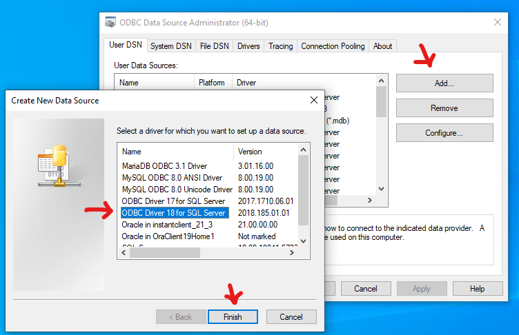
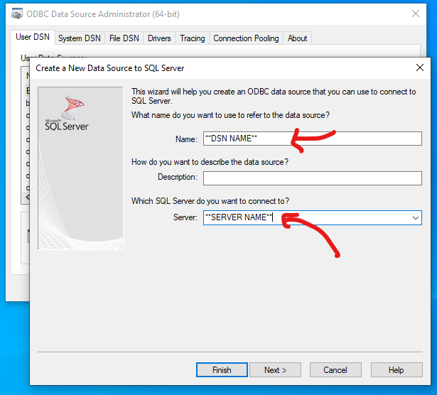

# ODBC Tasks

### Create Local DSN (for database users)

Goal: Create a local [user ODBC DSN](https://technet.microsoft.com/en-us/library/cc879308(v=sql.105).aspx)

1. Ask a BBMC member for the following three values.  Although these aren't passwords, we don't like to publicize them, because their values could give a hacker a headstart.

    1. **DSN Name**: which must match whatever value is specified in the client software (*e.g.*, R code or Access)

    1. **Server Name**: describes the machine that contains the multiple BBMC databases

    1. **Database Name**: describes the database for your specific project

1. Download and install [the most recent ODBC driver](https://docs.microsoft.com/en-us/sql/connect/odbc/download-odbc-driver-for-sql-server) for SQL Server, which is V17 as of October 2019.  Unless otherwise specified, choose the 64-bit driver version.  (FAQ: [determining](https://support.microsoft.com/en-us/help/15056/windows-7-32-64-bit-faq) if your OS is 32-bit vs 64-bit.)

    You may not have admin privileges on your computer.  If not, it's probably best to request IT to install the driver.

1. You need a VPN to connect to protected, on-campus systems or resources that specifically require VPN access while using a University-owned device on a trusted network (home Internet or personal cellular/hotspot). 

    1.  If you are having trouble connecting to a database server, you might need to contact the service desk.  Ask Andrew or Will for more instructions (located [in a private repo](https://github.com/OuhscBbmc/bbmc-database-management/blob/master/maintenance/setting-up-analyst/setting-up-analyst.md)).

    1.	End Users must use VDI if connecting to protected, on-campus systems or resources while using personally-owned devices that do not meet University security standards. 

        1. If you are off-campus and using a personally-owned or non-OU owned device, navigate to https://mydesk.ou.edu
        1. You should have two options, a standalone installer and an option for HTML access. Select the option for “Install VMWare Horizon Client”.
        1. You will now be linked to the VMWare download website. Select the “Go to Downloads” link for your operating system.
        1. Next click the Download button for your download, you can either download locally and then click to launch the file, or select Run if prompted by your browser.

1. Open the ODBC panel.  Click the Window's start button in the bottom left corner, and type 'ODBC'.  

    

1. Create the Data Source.  Choose the ODBC version you downloaded & installed a few steps above.  Click 'Add', then select the newest SQL Server driver, then click 'Finish.'

    

1. Specify the **DSN Name** in the first box and the **Server Name** in the third box.  You can leave the second box blank, or write something to help you remember the context later.  Treat it as case sensitive, although it won't matter in some scenarios.  Click 'Next'.

    

1. The boxes in the next screen should remain as their defaults.  This will leverage your Window's username and password with contacting the database.  You shouldn't ever have to enter your password for the database (either in this screen, or each time you contact the database).  Click 'Next'.

    

1. Change the default database to **Database Name**.  Treat it as case-sensitive.  Click 'Next'.

    

1. Keep the default values in the next screen.  Click 'Finish'.

    

1. Click 'Test Data Source' in the next screen.  The test should be successful.  *If so*, you can close everything related to the ODBC administration.  *If not*, look at the troubleshooting steps below.

    

### Troubleshooting (for database users and administrators)

1. If you can't download & install the driver, verify that you
    * Have administrative privileges on the machine.
    * Selected the correct 32/64 version.
    * Selected a driver version that's compatible with your operating system.

1. If the 'Test Data Source' fails, verify that
    * Your computer is connected to the campus network.  If you're off-campus, VPN access may not be adequate.
    * The **DSN Name**, **Server Name**, and **Database Name** are correct.
    * A BBMC database administrator has correctly (a) created a *server* login and (b) created a *database* user account, and (c) granted  adequate privileges to the database user account.


### Add user privileges (for database admins)

The BBMC DBA should run the following sql after changing the user and database names on lines 3 & 4.

*The dynamic `USE` statement isn't working yet.  We need to find a way to use it programmatically.*

```sql
DECLARE @qualified_user_name nvarchar(255); SET @qualified_user_name = '[OUHSC\wpreston]' 
DECLARE @database_name       nvarchar(255); SET @database_name       = '[go_round_in_circles]'

--== Nothing below this point should require modification. ==--

-- Server-wide modifications.
USE [master]
GO

DECLARE @create_login nvarchar(255); SET @create_login = 'CREATE LOGIN ' + @qualified_user_name + ' FROM WINDOWS ' -- WITH DEFAULT_DATABASE=[master]'
DECLARE @use          nvarchar(max); SET @use          = 'USE ' + @database_name + ';'
DECLARE @create_user  nvarchar(255); SET @create_user  = 'CREATE USER '  + @qualified_user_name + ' FOR LOGIN ' + @qualified_user_name

print 'login & user name: '  + @qualified_user_name;
print 'database to modify: ' + @database_name;
print 'user created: '       + @create_user

-- Database-specific modifications.
EXEC (
    @use + ';' +
    @create_user + ';'+
    
    'exec sp_addrolemember N''db_datareader '',' + @qualified_user_name +';'+
    'exec sp_addrolemember N''db_datawriter '',' + @qualified_user_name +';'
)

```

*last revised 2017-05-23 by Will Beasley*
