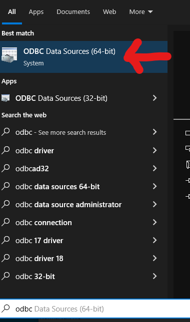
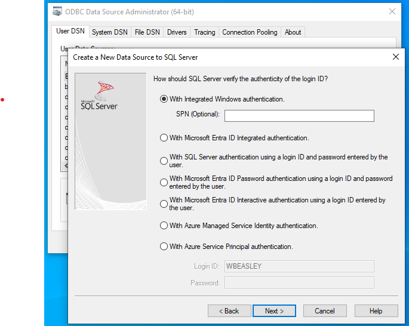
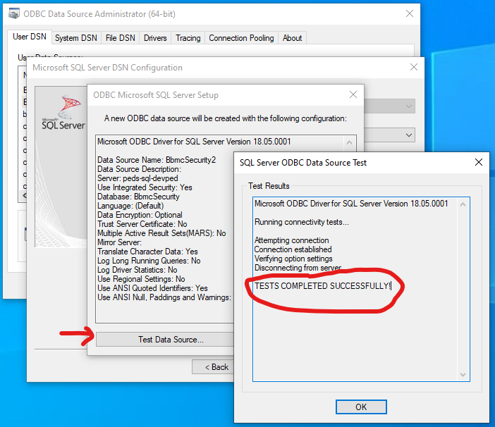

# ODBC Tasks

### Create Local DSN

Goal: Create a local [user ODBC DSN](https://technet.microsoft.com/en-us/library/cc879308(v=sql.105).aspx)

1. Ask a BBMC member for the following three values.  Although these aren't passwords, we don't like to publicize them, because their values could give a hacker a headstart.

    1. **DSN Name**: which must match whatever value is specified in the client software (eg, R code or Access)

    1. **Server Name**: describes the machine that contains the multiple BBMC databases

    1. **Database Name**: describes the database for your specific project

1. Download and install the most recent ODBC driver for SQL Server, which is [V13.1](https://www.microsoft.com/en-us/download/details.aspx?id=53339) as of March 2017.  Unless otherwise specified, choose the 64-bit driver version.  (FAQ: [determining](https://support.microsoft.com/en-us/help/15056/windows-7-32-64-bit-faq) if your OS is 32-bit vs 64-bit.)

    You may not have admin privileges on your computer.  If not, it's probably best to request IT to install the driver.

1. Open the ODBC panel.  Click the Window's start button in the bottom left corner, and type 'ODBC'.  

    

1. Create the Data Source.  Click 'Add', then select the newest SQL Server driver, then click 'Finish.'

    

1. Specify the **DSN Name** in the first box and the **Server Name** in the third box.  You can leave the second box blank, or write something to help you remember the context later.  Treat it as case sensitive, although it won't matter in some scenarios.  Click 'Next'.

    

1. The boxes in the next screen should remain as their defaults.  This will leverage your Window's username and password with contacting the database.  You shouldn't ever have to enter your password for the database (either in this screen, or each time you contact the database).  Click 'Next'.

    

1. Change the default database to **Database Name**.  Treat it as case-sensitive.  Click 'Next'.

    

1. Keep the default values in the next screen.  Click 'Finish'.

    

1. Click 'Test Data Source' in the next screen.  The test should be successful.  *If so*, you can close everything related to the ODBC administration.  *If not*, look at the troubleshooting steps below.

    
